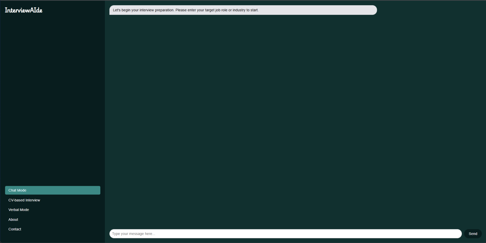

# InterviewAIde - AI Interview Assistant

## Overview

**InterviewAIde** is a web-based AI-powered interview assistant that generates interview questions, analyzes CVs, and provides personalized feedback. Built with **Node.js** and **Express**, this tool helps candidates practice interviews, prepare for real-world scenarios, and improve performance.

Key features include:  
- **Domain-specific interview questions** generated based on the candidate’s profile or CV.  
- **CV upload and analysis** to extract skills, experience, and education.  
- **Feedback generation** for answers to help candidates improve.

<p align="center">

</p>

---

## Features

- **Interview Question Generation**:  
  Generate interview questions tailored to the selected job domain or candidate’s background.

- **CV Upload & Analysis**:  
  Upload and analyze CVs to generate personalized interview questions.

- **Live Interview Mode**:  
  Practice text-based or oral interviews with AI-generated questions.

- **Feedback Generation**:  
  Receive detailed feedback after interviews highlighting strengths, weaknesses, and actionable suggestions.

---

## Requirements

### Software Requirements:
- **Node.js** (Latest LTS version)  
- **Express.js** (Web framework)  
- **EJS** (Template engine)  
- **CSS/HTML** (Frontend UI)  
- **Optional**: Open-source LLM or AI API for generating interview questions

---

## Setup Instructions

### Step-by-Step Setup

1. **Clone the Repository**
```bash
git clone <REPO_URL>
cd InterviewAIde
```

2. **Create a Virtual Environment:**
    ```bash
    python -m venv .venv
    ```

3. **Activate the Virtual Environment:**
    - **Windows:**
      ```bash
      .venv\Scripts\activate
      ```
    - **Linux/Mac:**
      ```bash
      source .venv/bin/activate
      ```

4. **Install Dependencies:**
    ```bash
    pip install groq flask requests
    ```

5. **Set Your **GROQ_API_KEY**:**
    - **Windows:**
      ```bash
      $env:GROQ_API_KEY = "your-api-key-here"
      ```
    - **Linux/Mac:**
      ```bash
      export GROQ_API_KEY="your-api-key-here"
      ```

6. **Run the Flask API Server:**
    In the terminal, run:
    ```bash
    python api.py
    ```

    This will start the Flask server, which handles the backend API calls and routes.
